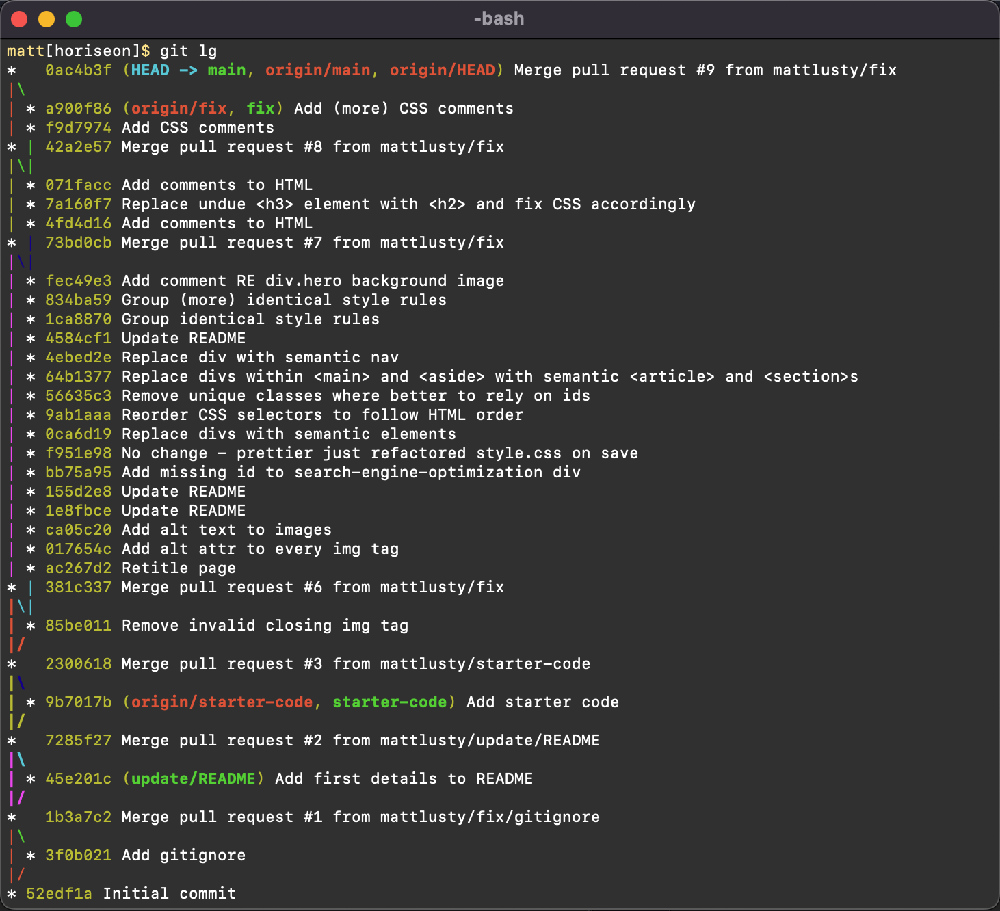

# Horiseon

## Website

https://mattlusty.github.io/horiseon

## Description

As Horiseon...

- Our company needs to make visible our services and attract clients who need our services.
- We built this website to make visible and advertise our services and the benefits they provide.
- It solves the problem of clients from around the world not being aware of our services.
- We learnt that to optimise our website's visibility to search engines we must ensure that the HTML structure is semantic and provides meaning and purpose to search engines.

As a Bootcamp Student I learned lessons such as ...

- the webpage needs a meaningful, descriptive \<title\>.
- images require src and alt attributes.
- Headings \<h?\> should be used in sequential order.
- Semantic (meaningful) elements sgiould be favoured over unsemantic meaningless elements such as divs.

## Usage

Jump Links

- To find relevant articles on the page quickly, users can click the navigation items in the header nav, and these links will jump the user to desired location on the page!

## License

N/A

## Features

Jump Links (self anchors)

- In nav the items are linked to ids of elements within the page, allowing users to rapidly move to selected content sections.

## Notes

I added alt attr text to the three main section images.

- However, I did not believe it was neccessary however to add alt text descriptions to the large CSS image at the top of the page, nor the icon graphics on the right side of th page because they are more decorative than functional.

## Feedback Request from Reviewer

I have made a GitHub Issue for some queries.

Please could the marker provide feedback to these?

I have read [W3C HTML Semantic Elements](https://www.w3schools.com/html/html5_semantic_elements.asp) and it seems theres a lot of subjectivity to different use cases.

1. Issue: [Main vs Aside?](https://github.com/mattlusty/horiseon/issues/14)

- I put .content into a \<main\> and .benefits into an \<aside\>

- Is this ok or should they be equal sections and thus the same semantic element?

2. Issue: [Section vs Article?](https://github.com/mattlusty/horiseon/issues/15)

- Within the \<main\> ... for sub-sections I used \<section\>s and within the \<aside\> I used \<article\>s

- Is this okay and ...

- When should I use \<section\> and when should I use \<article\>?

3. Issue: [Skipping \<h2\> straight to using \<h3\>](https://github.com/mattlusty/horiseon/issues/16)

- The next level headings within the \<section\> are \<h2\> and for \<aside\> they were \<h3\>

- As these headings are on the same nested level, should they both be \<h2\>?

- (... because the \<h3\> headings in \<aside\> have skipped the \<h2\> - ie this \<h3\> has no \<h2\> in its ancestor hierarchy)

- Or is it acceptable to skip to straight to \<h3\> because \<aside\> is less important than \<main\>?

4. Issue: [Bootstrap-like classes for CSS Styles](https://github.com/mattlusty/horiseon/issues/17)

- Does it go against semantic philosophy to use bootstrap-like classes to add styles to HTML elements...

- ie the CSS .float-left class?

## Git commit history

Issue: [Git Flow](https://github.com/mattlusty/horiseon/issues/19)

Please could you provide any feedback on how I have handled my git flow, commit patterns, commit messages, pulling and pushing to and from main etc? Thanks :)

